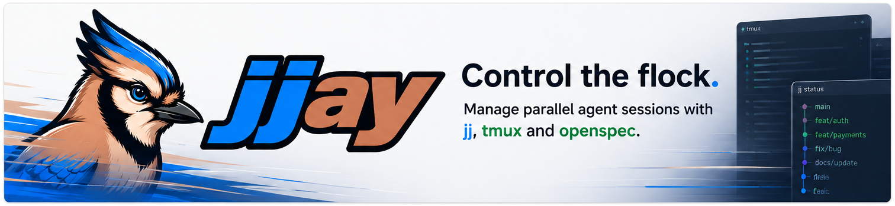

<p align="center">
  
</p>

[](coverage.html)

# jjay

Manage parallel AI agent sessions with **jj**, **tmux**, and **openspec**.

> **Alpha** — jjay is under active development. Usage could be risky.

## What jjay automates

Running multiple coding agents in parallel (Claude, Codex, Mistral) requires a repetitive manual workflow. This is the process jjay will replace:

### 1. Spawn a workspace

```bash
# Create a new tmux window
tmux new-window -n "feat/payments"

# Create an isolated jj workspace
jj workspace add ../myproject-workspaces/feat-payments
cd ../myproject-workspaces/feat-payments

# Launch a coding agent on the task
claude "/opsx:apply feat-payments" --dangerously-skip-permissions
```

### 2. Repeat for parallel agents

Spin up as many workspaces as you need — each agent works in isolation.

### 3. Test

Manually verify the results in each workspace.

### 4. Archive the change

```bash
openspec archive --change feat-payments
jj describe -m "feat: add payment processing"
```

### 5. Merge into main

```bash
jj new main feat-payments -m "merge feat-payments into main"
jj bookmark set main -r @
```

### 6. Cleanup

```bash
jj workspace forget feat-payments
rm -rf ../myproject-workspaces/feat-payments
tmux kill-window -t "feat/payments"
```

jjay will handle all of this with a single command.

## Tech stack

- **Go** — single-binary CLI, cobra for commands, bubbletea for future TUI
- [jj (Jujutsu)](https://martinvonz.github.io/jj/) — version control and workspace isolation
- [tmux](https://github.com/tmux/tmux) — terminal session and window management
- [openspec](https://github.com/speclib/openspec) — change tracking and task specs

## Installation

### Nix

```bash
# Run directly
nix run github:mipmip/jjay -- version

# Or add to your flake inputs
```

### From source

```bash
go install ./cmd/jjay
```

## CLI

```
jjay session-open <path>  Create and switch to a tmux session for a jj repo
jjay spawn <change>       Create workspace + tmux window + launch agent
jjay status               List spawned workspaces, task progress, and window state
jjay merge <change>       Merge workspace into main
jjay cleanup <change>     Tear down workspace + tmux window + directory
jjay version              Print version
```

### Shell completion

The change-name argument of `spawn`, `merge`, and `cleanup` tab-completes, each
filtered to the candidates that verb can actually act on:

- `jjay spawn <TAB>` → openspec changes that do **not** yet have a workspace
  (you can't spawn an already-spawned change).
- `jjay merge <TAB>` / `jjay cleanup <TAB>` → existing spawned workspaces (the
  `default` main working copy is never offered).

Completion is fast and side-effect free — it reads only `openspec list` and
`jj workspace list` (no tmux, no task files) — and degrades silently to no
candidates if a source can't be read.

Install the completion script for your shell with `jjay completion <shell>`
(`bash`, `zsh`, `fish`, or `powershell`); follow the script's own header for
where to source it.

### `jjay status`

Lists every spawned jj workspace with its task progress and whether a matching
`ws-<change>` tmux window exists in the current session:

```
CHANGE     WORKSPACE                       TASKS         ARCHIVED  STATUS
add-foo    ../myproject-workspaces/add-foo 12/18 (66%)   no        attached
old-feat   ../myproject-workspaces/old-feat 5/5 (100%)   yes       detached
```

- **WORKSPACE** is shown **relative to the main repo root**, and is resolved
  correctly even when `jjay status` is run from inside a child workspace.
- **TASKS** is `done/total (percent)`, read from the change's `tasks.md`; `-`
  means no tasks file was found.
- **ARCHIVED** is **yes** when the change has been archived. Task counts are
  then read from `openspec/changes/archive/<date>-<change>/tasks.md` instead of
  the active `openspec/changes/<change>/tasks.md`, so archived spawns still
  report their progress.
- **STATUS** is **attached** when a `ws-<change>` window exists in the current
  session, otherwise **detached** — the workspace is still open on disk, there
  is just no live window/agent for it (e.g. after a detach or reboot).

Status is read-only and derives everything live from `jj workspace list` +
`tmux list-windows`; it persists no state (see
[ADR-006](openspec/adrs/006-workspace-is-source-of-truth.md)). With no tmux
server running, every spawn is reported as detached.

### Reopen on `session-open`

The tmux view (windows + agents) is volatile, but jj workspaces are durable.
After creating and switching to the session, `jjay session-open` recreates a
`ws-<change>` window and relaunches the agent for every spawned workspace that
lacks one — restoring the view to match the workspaces on disk. Reopen is
best-effort: if one spawn fails to reopen, the rest still open and session-open
still succeeds, reporting which spawns failed.

## Claude Code integration

jjay ships a Claude Code integration layer under `.claude/` so agents (and you) drive the tool the way it was designed — spawning isolated workspaces rather than applying changes in place. Because `.claude/` is committed and spawned workspaces are jj copies of the repo, these propagate into every spawned workspace automatically.

### `/jjay:*` slash commands

Thin wrappers over the `jjay` binary — one per CLI verb:

| Command | Runs |
| --- | --- |
| `/jjay:spawn <change>` | `jjay spawn <change>` — workspace + tmux window + agent |
| `/jjay:status` | `jjay status` |
| `/jjay:merge <change>` | `jjay merge <change>` |
| `/jjay:cleanup <change>` | `jjay cleanup <change>` |
| `/jjay:session-open <path>` | `jjay session-open <path>` |

They reimplement no logic — the binary is the only source of behavior. Commands for change-name verbs prompt for the change (listing candidates via `openspec list --json` / `jjay status`) if you omit it.

### `jjay` orchestrator skill

`.claude/skills/jjay/SKILL.md` auto-loads when the conversation is about implementing or managing a change in this repo, and encodes the policy: **implement a change by spawning an isolated agent workspace (`/jjay:spawn`), not by running `/opsx:apply` in the main session.** It documents the lifecycle (explore → propose → spawn → status → merge → cleanup) and the **orchestrator-vs-worker** distinction — including the rule that a worker (an agent already running inside a spawned workspace) applies in place and must not recursively spawn.

### Precondition

The `/jjay:*` commands shell out to the `jjay` binary, so **`jjay` must be on `PATH`** in the session (true in spawned workspaces too, since they run in the same environment). See [Installation](#installation).

## Roadmap

- Core lifecycle commands (spawn, merge, cleanup)
- Agent status monitoring
- Multiple agent support (Claude, Codex, Mistral)
- Configurable tmux layouts
- Nix develop integration for workspace environments

## Contributing

Contributions are welcome. Fork the repo, create a branch, and open a pull request.

Found a bug or have an idea? [Open an issue](../../issues).

## License

[MIT](LICENSE)
